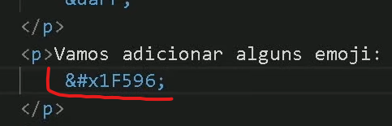

## 1 ( CODIGO 01 AL CREAR PAGINA HTML DESDE 0 ) 

```html 
 <!DOCTYPE html>
    <html lang="pt-br">
    <head>
        <meta charset="UTF-8">
        <meta name="viewport" content="width=device-width, initial-scale=1.0">
        <title>HTML-BASICO</title>
    </head>
    <body>
    </body>
    </head>
```

## 2 (Titulos Diferentes tamanhos)
```html              
        <h1> </h1>  
        <h2> </h2>
        <h3> </h3>
        <h4> </h4>
        <h5> </h5> 
        <h6> </h6>
```                    

## 3  (TAGS o "Etiquetas")  

```html
         Dica - usar &lt; = <    usar &gt; = > 

        <p> </p>    = (paragrafos) sirve para colocar letras normales sin ser titulos. 
        <HR>        = sirve para crear una linea de separacion
        <BR>        = SIRVE PARA QUEBRAR LINIA HACIA ABAJAO. 
        <b>  </b>   = Sirve PARA DEJAR TEXTO EN NEGRITO.
        <em> </em>  = tipo de letra
        <i>  </i>   = LETRA ITALICA
        <U>  </U>   = Letra SUbrayado

        <span> </span> = al colocar texto dentro de tag Span no hace nada al momento. es usada para encerrar un texto que quiera ser usado un css simple desde html para modificar color de ese texto en especifico etc. ejemplo 
                                            <span style="color:blue" > </span>

        <mark> </mark>     = MARCA EL TEXTO EN AMARILLO   
        <div>  </div>      = Textos separados o Divididos fuera del padron.
        <SMALl> </SMALl>   = lETRA PEQUEÑA
        <code> </code>     = Formato de letra mas usado para codigos de programacion.
        <PRE>  </PRE>      = SIRVE PRINCIPALMENTE PARA MANTENER LAS LETRAS PREFORMATADAS COM EL DISENHO QUE APARECE EN VS CODE. EJEMPLO AL ESCRIBIR UN CODIGO DE PROGRAMACION EN FORMA DE TEXTO - ejemplo > 
        <pre>
        <CODe>
            function randomNumber(number) {
                var result = Math.floor(Math.random() * number);
                return result;
                 }
        </CODe>
        </pre>

        <BLOckquote> </BLOckquote>  = SIRVE para colocar letra a estilo pasaje o sita
        <STROng>     </STROng>      = LETRA NEGRITA

        <label for="holaa"></label> = para escribir algo alante o despues de algun input

        <placeholder>  = sirve para tener algun texto de ejemplo dentro de un input de numbe-Email etc que esten en blanco.

        <fieldset> </fieldset>     = fixa o hace que todos los input queden dentro como un conjunto

        <legend> </legend>         = se coloca siempre abajo de <fieldset></fieldset> para ser como el titulo de todo.

        <dialog open> </dialog>   = es una tag mas Reciente de HTML Y al colocar <h1> o <p> cualquier mensaje de anuncio o informacion adicional para llamar la atencion y da para colocar asta botones dentro de la tag Ejemplo
             <dialog open> 
                <h1> Sabias que puedes aprender html de forma facil?</h1>
                <p> pues si y es tan facil que no te lo podrias ni imaginar</p>
                <p> y es totalmente nativo y gratis.</p>
                <button>clica aqui para saber mas.</button>
            </dialog>


```
* Descripcion de alguna palabra al passar el mouse ensima.
* Ejemplo:


## 4 (FORMULARIOS e Imputs)      

```html   
   <!---  (input mas usados - Furmulario simple ) -->
           
         <form>  
            <fieldset>
                <legend>Formulario simple</legend>
            <input type="text" >
            <br>

            <input type="number" name="" id="" placeholder="digite su tlf..">
            <br>

            <input type="password" name="" id="" placeholder=" coloque su contrasenha..">
            <br>

            <input type="button" value="boton">
            <br>

            <input type="submit" value="submit">
            <br>

            <textarea name="" id="" cols="30" rows="10"></textarea>
            <button>aceptar</button> 
            </fieldset>
       </form>
```
## Descripcion input de Formularios.
```html
<form action="/formulario" method="POST"> <!--Usar (action) y el "metodo" (method="POST" Es esencial para al enviar los datos de usuario al Submit funcionen bien y sean direccionados al servidor posteriormente. --> 

<label fype="text">Nombre</label> <!--Label es inportante para colocar texto refiriendose a cada imput y usarlos mas adelante con javascript para saber identificar cada imput con su respectivo Label -->

<label for="nombre">Nombre</label> <!-- al crear un Label para especificar siempre el nombre de un imput es siempre ussado la tag for=" " en todas las label para especificar a cual imput pertenece y tambien porque ella hace que al clicar en el nombre o "label" se vaya directamente al imput para que digites la informacion necesaria
Ejemplo;
        <label for="email">correo</label>
         <input value="email" type="email" id="email" name="email">
 -->

<input type="submit"> <!--submit = intenta enviar los dados del formulario leyendo desde form action="/formulario" method="POST"> buscando alguna ruta que este ai- -->

<input type="reset"> <!--reset = simplemente resetearia todo lo digitado en el formulario para comenzar desde 0 -->

<input type="button"> <!--button = al principio no aria nada, el es mas usado al dar una accion especifica desde javascript -->

<!--AL TENER ESO EN CUENTA. AQUI UNA ESTRUPTURA COMPLETA-->

<form>
    <label for="nombre">Nombre</label>
    <input value="Nombre" type="text" id="nombre" name="nombre">
    <br>
    <label for="apellido" >Apellido </label>
    <input value="apellido" type="text" id="apellido" name="apellido">
    <br>
    <label for="email">correo</label>
    <input value="email" type="email" id="email" name="email">
    <br>
    <label for="comentario">comentario</label>
    <textarea name="textarea" id="texarea" cols="30" rows="10">comentario</textarea> 
    <br>
    <input type="submit">
</form>


<!-- los formularios tienen como hacer validacion nativos com HTML Sin necesitar javascritp   
 usando por ejemplo la funcion Requered 
 ejemplo-->
<form>
    <label for="nombre">Nombre</label>
      <input value="Nombre" type="text" id="nombre" name="nombre" requered>
    <label for="email">correo</label>
      <input value="email" type="email" id="email" name="email" requered>
</form>
   
```
## (input Radio e checkbox)

* input Radio se puede usar por ejemplo para alquien en tu site escoger una opcion entre varias para escojer.
ejemplo...

```html

<h2>Elegir Color Favorito</h2>

<label for="verde">Verde</label>
    <input type="radio" name="color" id="verde" value="verde">
    <br> <br>

<label for="rojo">Rojo</label>
    <input type="radio" name="color" id="rojo" value="rojo">
    <br> <br>

<label for="amarillo">Amarillo</label>
    <input type="radio" name="color" id="amarillo" value="amarillo">

```
*  input checkbox sirve mas para dar a elegir entre varias cosas no solo una.
    ejemplo..
 ```html 
 
     <h2>Elige todos tus jobis favoritos</h2>

    <input type="checkbox" name="gustos" id="ejercicio">
        <label for="ejercicio">Ejercicio</label>    
            <br>
   <input type="checkbox" name="gustos" id="comida">
        <label for="comida">Comida</label>
            <br>
   <input type="checkbox" name="gustos" id="Juegos">
        <label for="juegos">Juegos</label>  

 ```

* Select (crea conjunto de opciones para seleccionar. )
    ejemplo..
```html

<select>
    <option selected disabled value=""> seleccione una opcion </option>
    <option value="rock"> Rock </option>
    <option value="metal"> Metal </option>
    <option value="merengue"> Merengue </option>
    <option value="salsa"> Salsa </option>
</select>


```

## 5 (IMAGENES, LINK, Download,)

```html
    <!--Sites esenciales para buscar imagenes sin derechos autorales para poder crear una pagina web --> 
        1 - unsplash 
        2 - pexels  
                                
        <!--Recordar  usar app (GIMP) que es gratuito y sirve para editar imagenes en formatos menores para que sean mas libianos para la creacion de sites,  y photopea es otra opcion es muy parecido a GIMP pero es directo desde el navegador --> 
        
        <!--O mejor aun, visitar - easy resize,  que transforma la imagen al tamanho mas pequenho posible en kb -->  
```
```html
        imagem en colocar dentro de la misma carpeta que estes trabajando y luego colocar -
                                    = 

        Imagem link de internet     =  

        Direccionar a una pagina web =  <a href="www.google.com"></a>

        crear link para descargar archivos-PDF,ZIP,img,etc   = <li> <a href="pastalibro/libro1.pdf" Download="libro1.pdf"  > bajar este libro aqui </li>   
``` 

# 6 (Audios y Videos al site web)
* Audio a la pagina web 
```html
<audio src="michaljackson.mp3" controls autoplay >musica de michael jackson</audio>
```
* Audio com varios formatos (Mas Recomendable) por si la pc del visitante no sea compatible.
* Recordar que toca descargar el mismo Mp3 en cada formato y anexarlos sea mp3, ogg, wav.
conforme ejemplo abajo:
```html
<audio preload="metadata" autoplay controls >
        <source src="pasta01/michaeljackson.mp3" type="audio/mpeg">
        <source src="pasta01/michaeljackson.ogg" type="audio/ogg">
        <source src="pasta01/michaeljackson.wav" type="audio/wav">
    </audio>

 ESTAN VARIAS OPCIONES QUE SE PUEDEN USAR DENTRO DE LA TAG AUDIO O VIDEO SUPER UTILES.

 width="100%" = tela 100xciento
 controls =  hace que aparesca control de play o pause 
 poster="imagen/foto-portada.png" = sirve colocar una imagen en el video antes de comenzar.
 
    <video>
        <source src="www.gogle.video.com ">
    </video>  
```
* Ahora todo sobre subir videos a html 

PAGINA pexels.com aperte de imagenes sin derechos autorales – tiene videos de cualquier cosa que quieras. Y te da la opcion de bajar el video en varios formatos. Y si es muy pesado y aparte quieres dejarlo com outro formato o que pesse mucho menos el video,
Es recomendable usar el app handbreak
Que cualquer arquivo mp4 etc que tengas puedes modificarlos bajarles la Resolucion y formatos mejores y mas livianos para tu pagina html.
Al abrirlo solo arrastras tu archivo de video dentro y ya automaticamente reconoce tu formato y haces las modificaciones que quieras.
Es recomendable colocar esta opcion que es mas liviana 
>EJEMPLO


* VIDEO - cOMO SUBIR VIDEO a La Pagina web

 La forma Mas Recomendada de usar es copiar un link com codigo directo de un servidor de videos como por ejemplo Youtube -  que en esse caso no necesitamos tener los videos en nuestra pc ni tener que crear varios formatos de compatibilidad en este caso no se necesita por eso es mucho mejor y mas Recomendado.
Seria de la siguiente forma.
Elegimos el video que queremos usar.
Clicamos en compartilhar.
Luego en incorporar, se va generar un Codigo = de html. lo compiamos y lo pegas tal cual en tu archivo html.
> Ejemplo:


## 7 (LISTAS ORDENADAS Y NO ORDENADAS)    
* lista ordenada        
```html       
        <ol>                                        
            <li>cafe</li>                                   
            <li>arroz</li>       
            <li>leche</li>
            <li>azucar</li>
``` 
* Lista no ordenada
```html        
        <ul>
            <li>cafe</li>
            <li>arroz</li>       
            <li>leche</li>
            <li>azucar</li>
         </ul>
```
* Dica - listas com funcion type
```html
<!-- Al colocar en qualquier lista la funcion type - puedes cambiar la forma de las listas. para numerica, abc.. letras romanas etc. 
        <ejemplo> -->

        <ul type="A">
            <li>cafe</li>
            <li>arroz</li>       
            <li>leche</li>
            <li>azucar</li>
        </ul>  
        
        (Otro ejemplo de lista)
        <h2>mis juegos favoritos</h2>
     <ol>
        <li>Antiguos</li>
        <UL type="square"> 
            <li>Max Payne1</li>
            <li>Max Payne2</li>
            <li>Max Payne3</li>
            <li>GTA IV </li>
        </UL> 
            <li>juegos mas actuales</li>
                <ul type="square">
                <li>guilwar2</li>
                <li>red dead redection2</li>
        </ul> 

    <!--DATALIST es parecido a crear listas pero las puede esconder como en una section de pestanha y al clicar seleccionas la que quieras que se muestre -->
    <!--Ejemplo -->

   <main>
        <section>
            <form method="post" action="/">
            <div>
            <datalist id="languages">
                <option value="javaScript"> </option>
                <OPTION value="python"> </option> 
                <OPTION value="c++"> </option>
                <OPTION value="PHP"> </option>
                <label>
                    con que leguje quieres que te ayude? 
                    <input list="languages"  name="languages">
                </label>
                </datalist> 
            </div>  
          </form>
        </section>
        </main>        


```     
## 8 (SIMBOLOS -EMOJIS e FAVICONS)  
*   Simbolos    
 ```html        
<!-- SIMBOLOS QUE EXISTEN DENTRO DE VISUAL STUDIO CODE 
    ALGUNOS DE MUCHOS SIMBOLOS SON -->
       &reg;  &copy;  &trade; &euro;  &pound;
       &cent; &Delta; 
<!-- al colocar  & vscode va sugiriendo mas simbolos. -->
    
```
* Emojis
```html

<!--site util de emojis - (EMOJIPIDEDIA) 

    Al encontrar los Emoji que gustes en el site aparece un codigo similar
    para cada emoji ejemplo - U+1F596   SIMPRE COMPIA DESPUES DEL +

    AL COLOCARLO DENTRO DE VSCODE QUEDARIA ASI - &#x1F596; -->
```
> ejemplo:





* Favicons


```html
<!--
    (Favicons) son tipo un iconos que da para colocar en la parte de arriba al crear un site - cerca donde aparece link de cada pagina.

    2 sites interesantes para encontrar favicons y crear favicons
    1er site - iconarchive 
    2do site - favicon.io  
    Al crear tu disenho favicon, descargar y colocar dentro de tu pasta de creacion de site dentro de VS code 
    luego dentro de -->       

<link rel="shortcut icon" href="AQUI CLICAR EN CONTROLESPACIO Y USAR NOMBRE DEL ARCHIVO.Icon" type="image/x-icon">

<!-- (Recordar de colocar siempre arriba de la <tag> Title) ejemplo -->
<title></title>

```

# 9 (Crear Imagenes adaptables a telas para celular, tables, o monitores grandes.)

* las imagenes a usar, crear 3 de cada misma imagen com Tamanho grande 1050px media 750px
pequenha 350px  - y mantener ese orden, la mas pequenha ser llamada en la primera linea de arriba la media luego y el formato mayor en la ultima linea de abajo conforme Codigo.
> Ejemplo:
```html
<picture>

<source media="(max-width: 750px)" srcset="pasta01/imagen-p.png" type="image/png">
<source media="(max-width: 1050px)" srcset="pasta01/imagen-m.png" type="image/png">


</picture>
 ```

 # 10 (Crear pagina web - tag primordiales.)

 * (Header) = se usa principalmente como cabezera de la pagina. colocar como el titulo o nombre del site web etc. 
* (Nav) = la tag nav significa nav de navegacion. es mas utilizada para colocar dentro listas y crear la parte de navegacion o pestamhs que va abajito de la cabezera de la pagina. donde colocaremos home - pagina principal - contacto, etc.
* (Section) = es donde colocamos todo el contenido principal que va justo abajo de la barra de navegacion. osea abajo de la tag Nav.
* (Article) = sirve o da especificacion que la parte principal dentro de section se coloca articulos sea textos paragrafos etc. osea section siempre va acompanhado com tag article dentro de section. para luego poder hacer modificaciones a articulos repetitivos o muy similares en el sitio web
* (Aside) = comunmente va abajo de Section, la tag Aside seria como otra section pero no tan importante. que iria como al lado de la section principal para mostar otros contenidos de la pagina web relacionados com la section principal. o tipo asi.

```html
 <header>     <!--CABEZERA DE PAGINA WEB -->
    <h1>mi blog </hi1>
</header>
    <nav>     <!--AREA DE NAVEGACION -->
        <ul>
        <li>Pagina principal </li>
        <li>segunda pagina </li>
        <li>Contacto </li>
        <li>Sobre </li>
        </ul>
    </nav>

<section>  <!--AREA DE CONTENIDO DE LA PAGINA WEB -->
    <article>
    <h2>titulo primer articulo </h1>
        <p>esto es un paragrafo de pueba para mostrar el contenido como va quedar</p> 
    </article>
    <article>
        <h2>titulo primer articulo </h1>
        <p>esto es un paragrafo de pueba para mostrar el contenido como va quedar</p> 
    </article>
</section>
    <aside>  <!--AREA SECUNDARIA DE CONTENIDO -->
    archivos - fechas
    mas contenidos Relacionados com section
    </aside>
    <footer>  <!--PIE O FINAL DE LA PAGINA. USADO PARA AREA DE CONTACTOS O ETC. -->
        Derechos Reservados 2018 2023
    </footer>
    
    
´```

    
   </html>